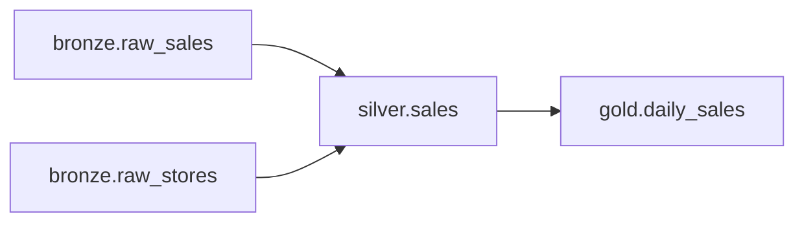

# Pipeline Documentation Guide

Ratatouille includes a documentation system that auto-generates and validates standardized documentation for all pipelines from `config.yaml` and SQL files.

## Overview

```
pipelines/silver/sales/
├── pipeline.sql          # Your transformation
├── config.yaml           # Enhanced with owner, tags, PII, rules
├── README.md             # ← Auto-generated
└── docs/
    ├── data_dictionary.md  # ← Auto-generated from columns
    ├── business_rules.md   # ← Auto-generated from SQL + tests
    └── lineage.md          # ← Auto-generated from {{ ref() }}
```

## Quick Start

```bash
# Generate docs for all pipelines
rat docs generate --workspace demo

# Generate for specific pipeline
rat docs generate -w demo -p silver/sales

# Validate completeness (blocks if errors)
rat docs check --workspace demo

# Strict mode (warnings = errors)
rat docs check -w demo --strict
```

---

## Enhanced config.yaml

The documentation system extends the standard config.yaml with additional fields for richer documentation.

### Full Example

```yaml
# 🐀 config.yaml - Enhanced pipeline configuration

description: |
  Transforms raw POS transactions into cleaned sales records.
  Filters invalid transactions and calculates totals.

# Owner can be a string (email) or object with team details
owner:
  team: data-platform
  email: data-team@acme.com
  slack: "#data-alerts"

columns:
  - name: txn_id
    type: string
    description: Unique transaction identifier
    pii: false                    # NEW: PII marking (required)
    example: "T00123"             # NEW: Example value
    tests: [not_null, unique]

  - name: customer_id
    type: string
    description: Customer identifier
    pii: true                     # NEW: Marked as PII
    pii_type: customer_id         # NEW: PII classification
    example: "C98765"

  - name: quantity
    type: int
    description: Quantity sold
    pii: false
    example: "2"
    tests: [not_null, positive]

freshness:
  warn_after: { hours: 6 }
  error_after: { hours: 24 }

# NEW: Documentation section
documentation:
  tags: [sales, finance, daily]
  rules:
    - name: positive_quantities
      description: Quantities must be greater than zero
      sql: "quantity > 0"
    - name: valid_total
      description: Total must equal quantity × unit_price
      sql: "ABS(total_amount - quantity * unit_price) <= 0.01"

tests:
  - name: total_equals_qty_times_price
    sql: |
      SELECT COUNT(*) FROM {{ this }}
      WHERE ABS(total_amount - quantity * unit_price) > 0.01
    expect: 0
```

### New Fields Reference

| Field | Location | Description |
|-------|----------|-------------|
| `owner.team` | Root | Team name owning the pipeline |
| `owner.email` | Root | Contact email |
| `owner.slack` | Root | Slack channel for alerts |
| `pii` | Column | `true`/`false` - Whether column contains PII |
| `pii_type` | Column | PII classification (e.g., `email`, `customer_id`, `ssn`) |
| `example` | Column | Example value for documentation |
| `documentation.tags` | Root | Categorization tags for discovery |
| `documentation.rules` | Root | Explicit business rules documentation |

---

## Generated Documentation

### README.md

The main pipeline documentation includes:

- **Tags** - Categorization badges
- **Overview** - Description from config
- **Owner** - Team, email, and Slack contact
- **Dependencies** - Upstream and downstream pipelines
- **Freshness SLA** - Warning and error thresholds
- **PII Notice** - Columns containing sensitive data
- **Schema Summary** - Quick reference table
- **Manual Content Section** - Preserved on regeneration

### docs/data_dictionary.md

Complete column documentation:

- **Summary** - Column counts, PII columns, required fields
- **Quick Reference** - Table with PII/Required/Unique flags
- **Column Definitions** - Detailed info for each column including type, PII status, examples, and constraints

### docs/business_rules.md

Business logic documentation gathered from three sources:

| Source | Icon | Description |
|--------|------|-------------|
| **Documented** | 📝 | Explicit rules in `documentation.rules` |
| **SQL** | 🔍 | Rules extracted from SQL WHERE clauses |
| **Test** | ✅ | Rules implied by column tests |

### docs/lineage.md

Pipeline dependency documentation:

- **Mermaid Diagram** - Visual flowchart of dependencies
- **Upstream Table** - Pipelines this one reads from
- **Downstream Table** - Pipelines that read from this one
- **Impact Analysis** - Warning about breaking changes

---

## Manual Content Preservation

Generated docs include markers to preserve your manual edits:

```markdown
# Sales Pipeline (auto-generated)

## Overview
...auto-generated content...

<!-- MANUAL CONTENT START -->
## Custom Notes

Your manual notes here are preserved on regeneration.

### Historical Context
This pipeline was migrated from legacy ETL in Q1 2024.
<!-- MANUAL CONTENT END -->
```

**How it works:**
1. When generating, the system looks for `<!-- MANUAL CONTENT START -->` and `<!-- MANUAL CONTENT END -->` markers
2. Content between markers is extracted and preserved
3. New generation includes your preserved content

---

## Validation Rules

The `rat docs check` command validates documentation completeness.

### Error Rules (Blocking)

| Rule | Description |
|------|-------------|
| `readme_exists` | README.md must exist |
| `description_length` | Description must be at least 50 characters |
| `owner_defined` | Owner (email or team) must be set |
| `pii_marked` | All columns must have `pii: true` or `pii: false` |

### Warning Rules (Non-blocking)

| Rule | Description |
|------|-------------|
| `data_dictionary_exists` | docs/data_dictionary.md should exist |
| `column_descriptions` | All columns should have descriptions |
| `freshness_defined` | Custom freshness SLA should be set |
| `lineage_exists` | docs/lineage.md should exist |

### Strict Mode

```bash
# Normal mode: only errors fail
rat docs check -w demo
# Exit code: 0 if no errors (warnings OK)

# Strict mode: warnings become errors
rat docs check -w demo --strict
# Exit code: 1 if any warnings or errors
```

---

## CLI Reference

```bash
rat docs [COMMAND] [OPTIONS]

Commands:
  generate    Generate documentation for pipelines
  check       Validate documentation completeness

Generate Options:
  --workspace, -w    Workspace name or path (default: current)
  --pipeline, -p     Generate for specific pipeline only

Check Options:
  --workspace, -w    Workspace name or path (default: current)
  --strict           Treat warnings as errors
  --verbose, -v      Show all pipelines, not just failures
```

### Examples

```bash
# Generate docs for entire workspace
rat docs generate -w demo

# Generate docs for a single pipeline
rat docs generate -w demo -p silver/sales

# Check completeness (CI/CD friendly)
rat docs check -w demo

# Strict mode for production deployments
rat docs check -w demo --strict

# Verbose output to see all results
rat docs check -w demo -v
```

---

## PII Tracking

The documentation system helps track PII (Personally Identifiable Information) across pipelines.

### Marking PII Columns

```yaml
columns:
  - name: email
    pii: true
    pii_type: email

  - name: customer_id
    pii: true
    pii_type: customer_id

  - name: store_id
    pii: false  # Explicitly not PII
```

### Common PII Types

| Type | Description |
|------|-------------|
| `email` | Email addresses |
| `phone` | Phone numbers |
| `ssn` | Social Security Numbers |
| `customer_id` | Customer identifiers |
| `ip_address` | IP addresses |
| `name` | Personal names |
| `address` | Physical addresses |

### Generated PII Notice

When a pipeline has PII columns, the README includes:

```markdown
## ⚠️ PII Notice

This pipeline contains personally identifiable information (PII):

- `customer_id` (customer_id): Customer identifier
- `email` (email): Customer email address

Handle this data according to your organization's data privacy policy.
```

---

## Lineage Diagrams

The system automatically generates Mermaid diagrams from `{{ ref() }}` calls in SQL.

### Example SQL

```sql
-- pipeline.sql
SELECT *
FROM {{ ref('bronze.raw_sales') }}
JOIN {{ ref('bronze.raw_stores') }} ON ...
```

### Generated Diagram



### Workspace-wide Lineage

The lineage system tracks downstream consumers by scanning all pipelines:

```
┌─────────────────────────────────────────────────┐
│ subgraph BRONZE                                 │
│   bronze_raw_sales["bronze.raw_sales"]          │
│ end                                             │
│                                                 │
│ subgraph SILVER                                 │
│   silver_sales["silver.sales"]                  │
│ end                                             │
│                                                 │
│ subgraph GOLD                                   │
│   gold_daily_sales["gold.daily_sales"]          │
│ end                                             │
│                                                 │
│ bronze_raw_sales --> silver_sales               │
│ silver_sales --> gold_daily_sales               │
└─────────────────────────────────────────────────┘
```

---

## Business Rules Extraction

Business rules are automatically extracted from multiple sources.

### 1. Explicit Documentation

```yaml
# config.yaml
documentation:
  rules:
    - name: positive_quantities
      description: Quantities must be greater than zero
      sql: "quantity > 0"
```

### 2. SQL WHERE Clauses

```sql
-- pipeline.sql
SELECT * FROM {{ ref('bronze.raw_sales') }}
WHERE quantity > 0         -- Extracted as rule
  AND unit_price > 0       -- Extracted as rule
  AND txn_id IS NOT NULL   -- Extracted as rule
```

### 3. Column Tests

```yaml
columns:
  - name: txn_id
    tests: [not_null, unique]  # Becomes: "txn_id is required", "txn_id must be unique"

  - name: quantity
    tests: [positive]          # Becomes: "quantity must be greater than zero"
```

---

## Best Practices

### 1. Always Mark PII Status

```yaml
columns:
  - name: store_id
    pii: false    # Explicitly mark as NOT PII
```

This ensures the `pii_marked` validation passes.

### 2. Write Meaningful Descriptions

```yaml
description: |
  Transforms raw POS transactions into cleaned sales records.

  Key transformations:
  - Filters invalid records (quantity <= 0, price <= 0)
  - Standardizes text fields to uppercase
  - Calculates total_amount from quantity × unit_price
```

Minimum 50 characters required.

### 3. Define Owner Contact

```yaml
owner:
  team: data-platform
  email: data-team@acme.com
  slack: "#data-alerts"
```

This helps with ownership and incident response.

### 4. Use Tags for Discovery

```yaml
documentation:
  tags: [sales, finance, daily, critical]
```

Tags help teams discover related pipelines.

### 5. Document Business Rules Explicitly

```yaml
documentation:
  rules:
    - name: valid_total
      description: Total must equal quantity × unit_price (within $0.01)
      sql: "ABS(total_amount - quantity * unit_price) <= 0.01"
```

Explicit rules are clearer than auto-extracted ones.

---

## CI/CD Integration

### GitHub Actions Example

```yaml
name: Validate Documentation

on: [push, pull_request]

jobs:
  docs-check:
    runs-on: ubuntu-latest
    steps:
      - uses: actions/checkout@v4

      - name: Start services
        run: docker compose up -d

      - name: Check documentation
        run: |
          docker compose exec -T dagster rat docs check -w demo --strict

      - name: Generate docs (on main)
        if: github.ref == 'refs/heads/main'
        run: |
          docker compose exec -T dagster rat docs generate -w demo

      - name: Commit generated docs
        if: github.ref == 'refs/heads/main'
        uses: stefanzweifel/git-auto-commit-action@v5
        with:
          commit_message: "docs: Auto-generate pipeline documentation"
```

### Pre-commit Hook

```bash
#!/bin/bash
# .git/hooks/pre-commit

# Check documentation before commit
docker compose exec -T dagster rat docs check -w demo
if [ $? -ne 0 ]; then
    echo "❌ Documentation validation failed"
    exit 1
fi
```

---

## Troubleshooting

### "Columns missing pii marking"

```
❌ pii_marked: Columns missing pii marking: store_id, product_name
```

**Solution:** Add `pii: true` or `pii: false` to each column in config.yaml.

### "Description too short"

```
❌ description_length: Description too short (35 chars, need 50+)
```

**Solution:** Write a more detailed description explaining what the pipeline does.

### "No owner defined"

```
❌ owner_defined: No owner defined
```

**Solution:** Add an `owner` field with at least an email or team name.

### "README.md not found"

```
❌ readme_exists: README.md not found
```

**Solution:** Run `rat docs generate` to create the documentation files.

### Manual Content Lost

If your manual content disappears after regeneration:

1. Ensure markers are exactly: `<!-- MANUAL CONTENT START -->` and `<!-- MANUAL CONTENT END -->`
2. Check for extra whitespace or typos in markers
3. Content must be between the markers, not outside
