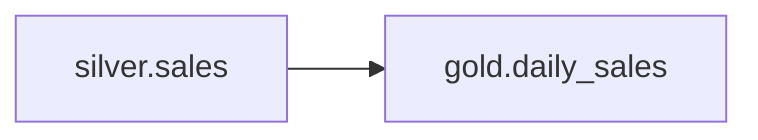

# Lineage: Daily Sales

> 🐀 Auto-generated | Layer: `gold` | Last updated: 2026-02-05

## Summary

- **Pipeline:** `gold.daily_sales`
- **Layer:** gold
- **Upstream dependencies:** 1
- **Downstream consumers:** 0

## Pipeline Diagram

## Upstream Dependencies

This pipeline reads from:

| Source | Layer | Description |
|--------|-------|-------------|
| `silver.sales` | SILVER | - |

## Downstream Consumers

*No downstream pipelines consume this data (yet).*

## Impact Analysis

This pipeline has no downstream dependencies. Changes can be made safely.
