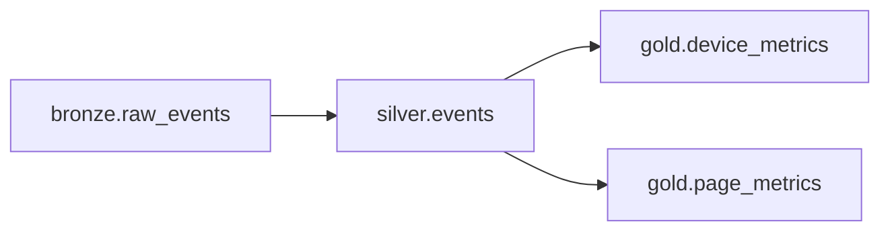

# Lineage: Events

> 🐀 Auto-generated | Layer: `silver` | Last updated: 2026-02-05

## Summary

- **Pipeline:** `silver.events`
- **Layer:** silver
- **Upstream dependencies:** 1
- **Downstream consumers:** 2

## Pipeline Diagram

## Upstream Dependencies

This pipeline reads from:

| Source | Layer | Description |
|--------|-------|-------------|
| `bronze.raw_events` | BRONZE | - |

## Downstream Consumers

This pipeline is consumed by:

| Consumer | Layer | Description |
|----------|-------|-------------|
| `gold.device_metrics` | GOLD | - |
| `gold.page_metrics` | GOLD | - |

## Impact Analysis

### ⚠️ Changes to this pipeline may affect:

- `gold.page_metrics`
- `gold.device_metrics`

Please coordinate with downstream owners before making breaking changes.
