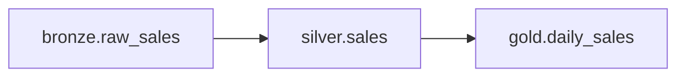

# Lineage: Sales

> 🐀 Auto-generated | Layer: `silver` | Last updated: 2026-02-05

## Summary

- **Pipeline:** `silver.sales`
- **Layer:** silver
- **Upstream dependencies:** 1
- **Downstream consumers:** 1

## Pipeline Diagram

## Upstream Dependencies

This pipeline reads from:

| Source | Layer | Description |
|--------|-------|-------------|
| `bronze.raw_sales` | BRONZE | - |

## Downstream Consumers

This pipeline is consumed by:

| Consumer | Layer | Description |
|----------|-------|-------------|
| `gold.daily_sales` | GOLD | - |

## Impact Analysis

### ⚠️ Changes to this pipeline may affect:

- `gold.daily_sales`

Please coordinate with downstream owners before making breaking changes.
